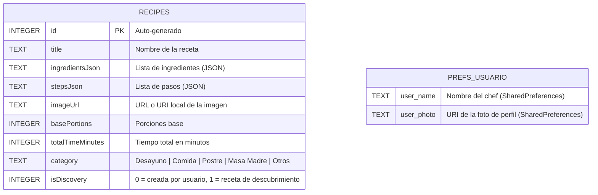

# 🫙 Moli — Asistente de Cocina Mexicana

> Aplicación Android nativa para gestionar recetas, cocinar paso a paso y organizar tiempos de cocción, con asistente de voz integrado.

---

## 🔗 Enlaces del Repositorio

| Recurso | URL |
|---|---|
| **Repositorio principal** | https://github.com/meyzx/MoliSystem |
| **Rama principal (master)** | https://github.com/meyzx/MoliSystem/tree/master |
| **Rama de mejoras UI** | https://github.com/meyzx/MoliSystem/tree/feat/ui-improvements |
| **Commits** | https://github.com/meyzx/MoliSystem/commits/master |
| **Pull Requests** | https://github.com/meyzx/MoliSystem/pulls |
| **Issues** | https://github.com/meyzx/MoliSystem/issues |
| **Releases / APK** | https://github.com/meyzx/MoliSystem/releases |

---

## 📋 Tablero de Gestión

### ✅ Completado

| ID | Funcionalidad | Módulo | Fecha |
|----|--------------|--------|-------|
| T-01 | Estructura base del proyecto Android | Setup | 26/02/2026 |
| T-02 | Listado de recetas con RecyclerView | Recetas | 26/02/2026 |
| T-03 | Pantalla de detalle de receta | Recetas | 19/03/2026 |
| T-04 | Crear receta con foto, ingredientes y pasos | Recetas | 19/03/2026 |
| T-05 | Modo cocina paso a paso con narración TTS | Cocina | 26/03/2026 |
| T-06 | Temporizador básico por paso de receta | Temporizador | 26/03/2026 |
| T-07 | Asistente de voz con palabra clave "Moli" | Voz | 26/03/2026 |
| T-08 | Barra de navegación inferior | Navegación | 26/03/2026 |
| T-09 | Buscador por título e ingredientes | Búsqueda | 26/03/2026 |
| T-10 | Filtros por categoría (Chips) | Filtrado | 26/03/2026 |
| T-11 | Calculadora de porciones | Recetas | 21/05/2026 |
| T-12 | Compilación y corrección Gradle | DevOps | 21/05/2026 |
| T-13 | Ícono personalizado olla talavera (todas las densidades) | UI | 27/05/2026 |
| T-14 | Multi-temporizador simultáneo con progreso circular | Temporizador | 27/05/2026 |
| T-15 | Rediseño de perfil de usuario con estadísticas reales | Perfil | 27/05/2026 |
| T-16 | Buscador integrador (receta + ingrediente) | Búsqueda | 27/05/2026 |

### 🔄 En Progreso

| ID | Funcionalidad | Responsable |
|----|--------------|-------------|
| T-17 | Publicación del APK en GitHub Releases | Mey |
| T-18 | Pruebas de integración en dispositivo físico | Mey |

### 📌 Pendiente / Backlog

| ID | Funcionalidad | Prioridad |
|----|--------------|-----------|
| T-19 | Sistema de favoritos por receta | Media |
| T-20 | Compartir receta como imagen o texto | Media |
| T-21 | Modo oscuro | Baja |
| T-22 | Sincronización en la nube (Firebase) | Baja |
| T-23 | Notificaciones push al terminar temporizador | Alta |
| T-24 | Importar receta desde URL web | Baja |

---

## 📜 Historial de Commits

| # | Hash | Fecha | Autor | Descripción |
|---|------|-------|-------|-------------|
| 7 | [`ec3d8e8`](https://github.com/meyzx/MoliSystem/commit/ec3d8e81312d38afb440b4bc67af4e2e5c2d0f8c) | 27/05/2026 | Mey | feat: ícono personalizado, multi-temporizador y rediseño de perfil |
| 6 | [`663e946`](https://github.com/meyzx/MoliSystem/commit/663e9461246f412f6df56ccbe323638dfce2541e) | 21/05/2026 | Mey | Corregir configuración de Gradle para que la app compile y abra |
| 5 | [`84efa46`](https://github.com/meyzx/MoliSystem/commit/84efa46d2565631fc48154d124a99c19c2f829a8) | 26/03/2026 | Mey | Timer personalizable · Corrección barra de navegación · Barra de búsqueda · Checklist ingredientes |
| 4 | [`3fbb213`](https://github.com/meyzx/MoliSystem/commit/3fbb213cdaa05702d67c4e75ca033fbdc2fd252c) | 26/03/2026 | Mey | Timer personalizable · Corrección barra de navegación · Barra de búsqueda · Checklist ingredientes |
| 3 | [`4f313b2`](https://github.com/meyzx/MoliSystem/commit/4f313b28351979d77581b1b26a29e09a37581f29) | 19/03/2026 | Mey | Avance proyecto |
| 2 | [`35258dd`](https://github.com/meyzx/MoliSystem/commit/35258ddd6b7e691c79f0e2f173d87fb51a49e46b) | 26/02/2026 | meyzx | Expand README with Moli app details |
| 1 | [`c866aa3`](https://github.com/meyzx/MoliSystem/commit/c866aa31aca6cbad40f618f4e5933ce250246d13) | 26/02/2026 | meyzx | Initial commit |

---

## 🗃️ Esquema Relacional

La base de datos local utiliza **Room (SQLite)**. Solo existe una tabla principal; las relaciones anidadas (ingredientes y pasos) se serializan como JSON dentro de la misma fila.



> **Nota:** `PREFS_USUARIO` no es una tabla SQL; sus datos se persisten en `SharedPreferences` bajo la clave `MoliPrefs`.

### Estructura interna del JSON de ingredientes

Cada entrada en `ingredientsJson` representa un objeto:

```json
{ "quantity": 500.0, "unit": "gr", "name": "Harina de fuerza" }
```

### Estructura interna del JSON de pasos

Cada entrada en `stepsJson` representa un objeto:

```json
{ "description": "Mezclar harina y agua", "timerDurationMinutes": 30 }
```

---

## 📖 Diccionario de Datos

### Tabla `recipes`

| Campo | Tipo SQLite | Nullable | Descripción | Ejemplo |
|-------|------------|----------|-------------|---------|
| `id` | `INTEGER` | No | Clave primaria auto-generada por Room | `1` |
| `title` | `TEXT` | No | Nombre completo de la receta | `"Chilaquiles Verdes"` |
| `ingredientsJson` | `TEXT` | No | Array JSON de objetos `Ingredient` serializados con Gson | `[{"quantity":12,"unit":"pzas","name":"Tortillas"}]` |
| `stepsJson` | `TEXT` | No | Array JSON de objetos `Step` serializados con Gson | `[{"description":"Freír...","timerDurationMinutes":10}]` |
| `imageUrl` | `TEXT` | No | URL pública (Unsplash) o URI local de galería | `"https://images.unsplash.com/..."` |
| `basePortions` | `INTEGER` | No | Número de porciones para el que está calculada la receta | `4` |
| `totalTimeMinutes` | `INTEGER` | No | Tiempo total de preparación + cocción en minutos | `25` |
| `category` | `TEXT` | No | Categoría culinaria de la receta | `"Desayuno"` |
| `isDiscovery` | `INTEGER` | No | `1` = receta precargada de descubrimiento, `0` = creada por el usuario | `1` |

### Clase `Ingredient` (JSON embebido)

| Campo | Tipo Kotlin | Descripción | Ejemplo |
|-------|------------|-------------|---------|
| `quantity` | `Double` | Cantidad numérica del ingrediente | `500.0` |
| `unit` | `String` | Unidad de medida (gr, ml, pzas, taza, etc.) | `"gr"` |
| `name` | `String` | Nombre del ingrediente | `"Harina de fuerza"` |

### Clase `Step` (JSON embebido)

| Campo | Tipo Kotlin | Nullable | Descripción | Ejemplo |
|-------|------------|----------|-------------|---------|
| `description` | `String` | No | Instrucción textual del paso | `"Mezclar la harina con el agua"` |
| `timerDurationMinutes` | `Int?` | Sí | Minutos del temporizador asociado al paso (`null` si no aplica) | `30` |

### SharedPreferences (`MoliPrefs`)

| Clave | Tipo | Descripción | Ejemplo |
|-------|------|-------------|---------|
| `user_name` | `String` | Nombre del chef guardado por el usuario | `"María"` |
| `user_photo` | `String` | URI persistente de la foto de perfil seleccionada | `"content://media/picker/..."` |

### Categorías válidas

| Valor | Descripción |
|-------|-------------|
| `Desayuno` | Platillos matutinos |
| `Comida` | Platillos principales del mediodía |
| `Postres` | Dulces y postres |
| `Masa Madre` | Recetas de fermentación y pan artesanal |
| `Otros` | Categoría por defecto para recetas sin clasificar |

---

## 📱 Manual de Usuario

### Requisitos previos

- Android **8.0 (API 26)** o superior
- Conexión a internet (solo para cargar imágenes de Unsplash en recetas de descubrimiento)
- Micrófono habilitado (para el asistente de voz)

---

### 1. Pantalla Principal — Descubrir Recetas

Al abrir la app se muestra el catálogo de recetas con fondo crema y paleta terracota.

**Elementos de la pantalla:**

| Elemento | Función |
|----------|---------|
| Saludo `¡Hola, Chef!` | Muestra el nombre guardado en el perfil |
| Botón 🎤 (terracota) | Activa el asistente de voz Moli |
| Barra de búsqueda | Filtra por **nombre de receta** o **ingrediente** |
| Chips de categoría | Filtra por: Todas · Desayuno · Comida |
| Tarjetas de receta | Muestra imagen, título, tiempo y categoría |
| FAB `+` (inferior) | Abre el formulario para crear una receta |

**Pestañas de la barra inferior:**

| Ícono | Destino |
|-------|---------|
| 🍽 Recetas | Alterna entre recetas de descubrimiento y recetas propias |
| ⏱ Timer | Abre el gestor de temporizadores múltiples |
| 👤 Perfil | Abre el perfil del chef |

---

### 2. Detalle de Receta

Al tocar una tarjeta de receta se abre el detalle.

**Funciones disponibles:**

- **Ajustar porciones**: usa los botones `−` y `+` para escalar automáticamente todos los ingredientes.
- **Lista de ingredientes**: toca cada línea para marcarla como ✅ completada al ir cocinando.
- **Ver pasos**: despliega los pasos de preparación numerados.
- **Iniciar modo cocina**: botón inferior para entrar al modo guiado paso a paso.

---

### 3. Modo Cocina (Paso a Paso)

Guía interactiva para cocinar sin perder el hilo.

| Control | Acción |
|---------|--------|
| `← Anterior` | Regresa al paso previo |
| `Siguiente →` | Avanza al siguiente paso |
| `▶ Iniciar timer` | Inicia el contador regresivo del paso (si tiene tiempo asignado) |
| 🔊 Narrar | Lee el paso en voz alta con Text-to-Speech |
| Barra de progreso | Muestra el porcentaje de avance en la receta |

---

### 4. Crear Receta

Accesible desde el botón `+` en la pantalla principal.

**Campos del formulario:**

1. **Foto** — Toca el área de imagen para seleccionar desde la galería.
2. **Nombre** — Título de la receta.
3. **Categoría** — Selector (Desayuno, Comida, Postres, Masa Madre, Otros).
4. **Porciones** — Número base de porciones.
5. **Tiempo total** — Minutos estimados de preparación.
6. **Ingredientes** — Botón `+ Ingrediente` agrega filas con cantidad, unidad y nombre.
7. **Pasos** — Botón `+ Paso` agrega una instrucción; se puede asignar un temporizador opcional a cada paso.
8. **Guardar** — Guarda la receta en la base de datos local.

---

### 5. Temporizadores Múltiples

Accesible desde el ícono ⏱ en la barra inferior.

**Funcionamiento:**

1. La pantalla muestra una lista de tarjetas de temporizador.
2. Cada tarjeta tiene un **anillo de progreso circular** que se va vaciando conforme pasa el tiempo.
3. Usa el botón **`+ Nuevo temporizador`** (inferior) para agregar tantos como necesites simultáneamente.

**Estados de cada temporizador:**

| Estado | Color | Botón |
|--------|-------|-------|
| IDLE (en espera) | Terracota | INICIAR |
| RUNNING (corriendo) | Terracota | PAUSAR |
| PAUSED (pausado) | Gris | CONTINUAR |
| FINISHED (terminado) | Verde ✓ | — |

**Acciones:**
- **Papelera 🗑**: elimina el temporizador (con opción de deshacer).
- **RESET**: cancela y regresa a la pantalla de configuración.
- Al terminar suena la notificación del sistema y el anillo cambia a verde.

---

### 6. Perfil del Chef

Accesible desde el ícono 👤 en la barra inferior.

**Secciones:**

| Sección | Descripción |
|---------|-------------|
| **Foto de perfil** | Toca la imagen o el `+` para seleccionar desde galería |
| **Nombre** | Campo editable; se refleja en el saludo de la pantalla principal |
| **Recetas** | Total de recetas en la base de datos |
| **Creadas** | Recetas añadidas por el usuario (no de descubrimiento) |
| **Min cocin.** | Suma de tiempos de todas las recetas en minutos |
| **Guardar cambios** | Persiste nombre y foto en SharedPreferences |
| **Cerrar sesión** | Limpia nombre y foto del dispositivo |

---

### 7. Asistente de Voz "Moli"

Actívalo con el botón 🎤 o di la palabra clave **"Moli"** en voz alta.

**Comandos reconocidos:**

| Comando | Acción |
|---------|--------|
| `"buscar [platillo]"` | Llena el buscador con el texto indicado |
| `"temporizador"` | Navega a la pantalla de temporizadores |
| `"perfil"` | Navega al perfil |
| `"recetas"` | Muestra las recetas de descubrimiento |

---

## 🏗️ Arquitectura del Proyecto

```
app/
├── java/com/example/moli/
│   ├── MainActivity.kt          # Pantalla principal, buscador, asistente de voz
│   ├── RecipeDetailActivity.kt  # Detalle y calculadora de porciones
│   ├── NewRecipeActivity.kt     # Formulario de creación de receta
│   ├── CookingModeActivity.kt   # Modo cocina paso a paso con TTS
│   ├── TimerActivity.kt         # Gestión de múltiples temporizadores
│   ├── TimerAdapter.kt          # RecyclerView adapter de temporizadores
│   ├── UserProfileActivity.kt   # Perfil del chef con estadísticas
│   ├── AppDatabase.kt           # Base de datos Room + datos iniciales
│   ├── RecipeDao.kt             # Queries SQL (Room DAO)
│   ├── RecipeEntities.kt        # Entidad Room + TypeConverters
│   └── Recipe.kt                # Modelos de dominio (Ingredient, Step, Recipe)
└── res/
    ├── layout/                  # Layouts XML de cada pantalla
    ├── drawable/                # Íconos vectoriales y fondos
    ├── mipmap-*/                # Ícono de app en todas las densidades
    └── values/                  # Colores, temas, strings
```

### Stack tecnológico

| Tecnología | Versión | Uso |
|-----------|---------|-----|
| Kotlin | 2.1.0 | Lenguaje principal |
| Android SDK | 36 (min 26) | Plataforma |
| Room | 2.6.1 | Base de datos local SQLite |
| Material Components | 1.12.0 | UI / Design System |
| Gson | 2.11.0 | Serialización JSON de ingredientes y pasos |
| Glide | 4.16.0 | Carga y caché de imágenes |
| Kotlin Coroutines | — | Operaciones asíncronas de BD |

---

## 👩‍💻 Autora

**Mey** — [@meyzx](https://github.com/meyzx)

Proyecto desarrollado como sistema de gestión de recetas de cocina mexicana con interfaz visual inspirada en la cerámica talavera.
